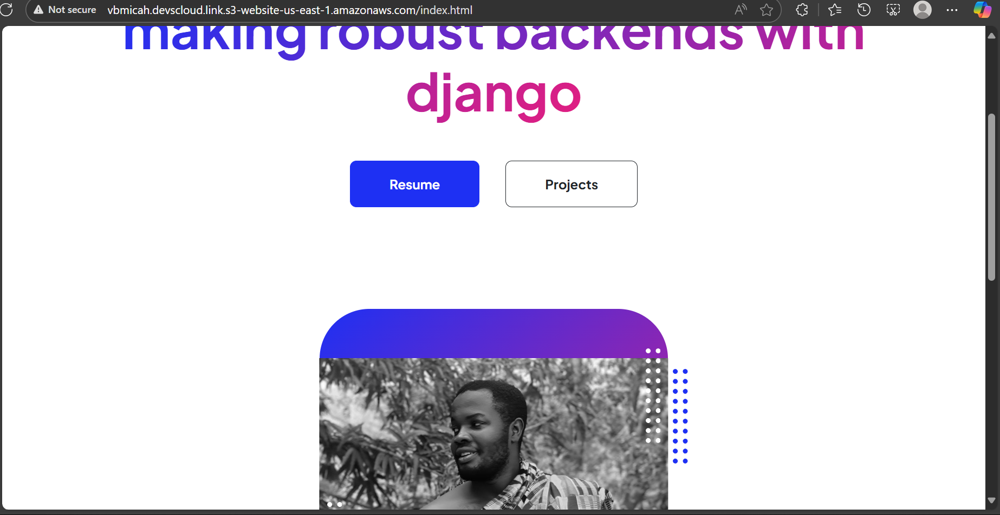

Welcome to my static portfolio website, built with HTML, CSS, and JavaScript, and efficiently hosted on Amazon S3.
This setup demonstrates a lightweight, serverless approach to deploying personal sites or portfolios,
leveraging AWS's robust infrastructure for global accessibility without the overhead of traditional web servers.

## Why S3 for Hosting Static Portfolio Sites?

Amazon S3 (Simple Storage Service) is an ideal choice for static websites like portfolios due to its unmatched efficiency in cost, performance, and management.
Here's why:

- **Cost-Effectiveness**: With a pay-as-you-go model, you only pay for storage (as low as $0.023/GB/month) and data transfer out, making it significantly cheaper than traditional hosting providers for low-to-moderate traffic sites. For a typical portfolio with 1GB storage and 10GB monthly transfer, expect under $1/month—far below EC2 or VPS alternatives.

- **Scalability and Performance**: S3 effortlessly handles unlimited traffic spikes (e.g., from viral shares) with 99.99% availability, serving content at super-fast speeds via integration with CloudFront's global edge network. No need to provision servers—it's truly serverless.

- **Reliability and Durability**: Enjoy 99.999999999% (11 9's) object durability, ensuring your portfolio assets are safe from data loss. This beats most shared hosting options in uptime guarantees.

- **Simplicity and Security**: Upload files via the AWS Console or CLI, enable static hosting in minutes, and apply fine-grained access policies—no DevOps expertise required. Built-in HTTPS support via CloudFront adds enterprise-grade security without extra cost.

Compared to alternatives like GitHub Pages (limited customization) or Netlify (free tier caps), S3 offers deeper AWS ecosystem integration for future growth, like adding Lambda for dynamic features.

## Quick Setup Guide

1. **Create an S3 Bucket**: Name it after your subdomain (e.g., `vbmicah.devscloud.link`).
  Enable static website hosting and set `index.html` as the index document.

2. **Upload Files**: Push your site's assets (HTML, CSS, JS, images) to the bucket root.

3. **Set Permissions**: Add a public read bucket policy:
   ```json
   {
       "Version": "2012-10-17",
       "Statement": [
           {
               "Sid": "PublicReadGetObject",
               "Effect": "Allow",
               "Principal": "*",
               "Action": "s3:GetObject",
               "Resource": "arn:aws:s3:::vbmicah.devscloud.link/*"
           }
       ]
   }
   ```

4. **Configure Route 53**: In your `devscloud.link` hosted zone, create an A record alias to the S3 website endpoint.

5. **Optional: Add HTTPS**: Use CloudFront with an ACM certificate for secure, faster delivery.

Test at `http://vbmicah.devscloud.link` (or HTTPS post-CloudFront).

For full details, see [AWS S3 Static Website Hosting Docs](https://docs.aws.amazon.com/AmazonS3/latest/userguide/WebsiteHosting.html).


## Cost Breakdown (Estimated for Portfolio)

| Component | Monthly Cost | Notes |
|-----------|--------------|-------|
| S3 Storage (1GB) | ~$0.023 | Standard class |
| Data Transfer Out (10GB) | ~$0.90 | First 100GB free via AWS Free Tier |
| Requests (1M GETs) | ~$0.004 | Negligible |
| **Total** | **<$1** | Scales linearly; Free Tier covers most hobby use |


## Contributing

Fork, improve, and PR! Ideas: Add dark mode, animations, or analytics.

## License

MIT License - feel free to adapt for your own portfolio.

---

Built with ❤️ on AWS.
